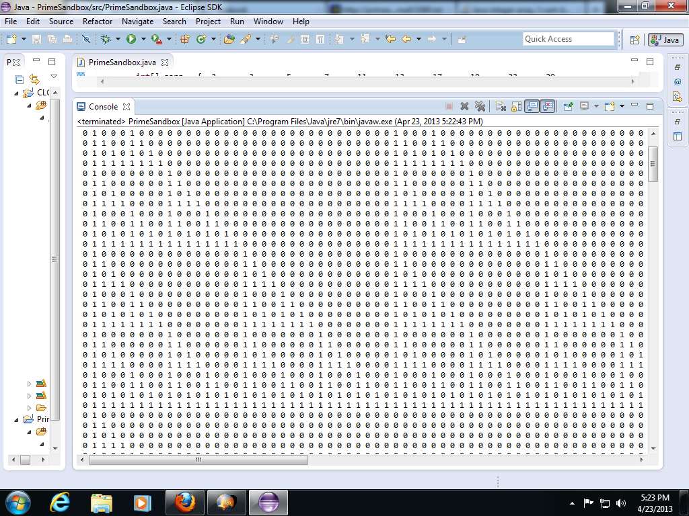
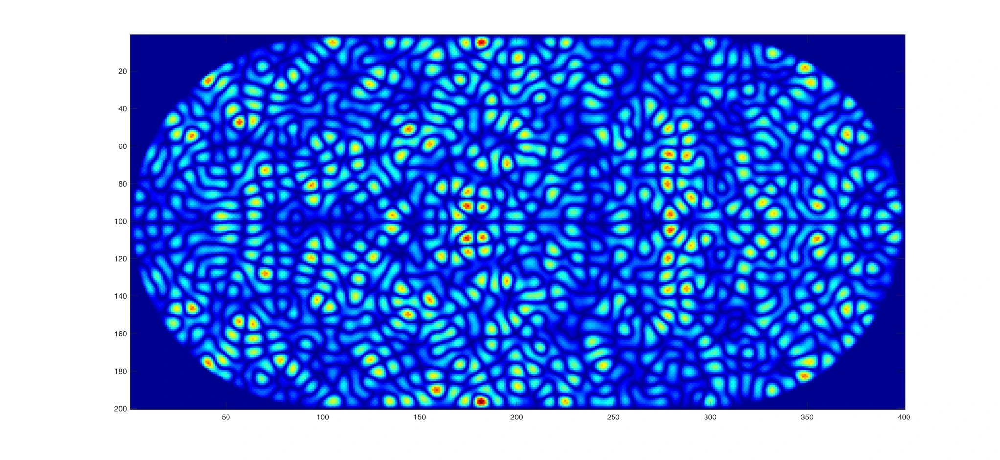
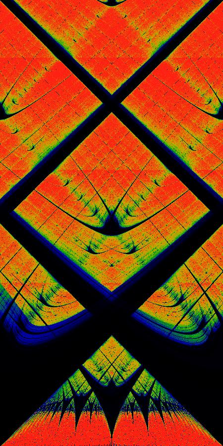

# Computation

### Machine Dreams

[Text](http://bach.ai/machine-dreams/)

Excerpt

> Artificial Intelligence provides a conceptual framework to understand mind and universe in new ways, clearing the obstacles that hindered the progress of philosophy and psychology. Let us see how AI can help us to understand how our minds create the experience of a universe.
> 
> Unlike the machine learning systems of the past, minds are not just classifiers or policy optimizers. Minds are not accumulators of knowledge about the world. Minds are generative systems: they actively produce the world that we subjectively experience. Ordinary day-time experiences are in fact dreams constrained by sensory data. This simple insight of contemporary cognitive science turns realist notions of embodiment on their head. The idea of the brain as a dreaming machine opens a way to understand the nature of our experiences.
> 
> This is the proposed fourth installment of a series of presentations about using AI perspectives to understand minds and their relationship to the universe. “How to build a mind” (30c3) suggested specifications for an architecture of cognition; “From computation to consciousness” (31c3) explored the mind’s computational foundations; “Computational metapsychology” (32c3) discussed the individual and social construction of meaning. “Machine dreams” sketches how the computational machinery of our brains leads to our experience a subjective world. We will look at the conductor theory of consciousness, some of the mental structures contributing to our models of self and world, and the unreasonable effectiveness of neural processes in modeling physics.

### Prime Numbers and Fractals (Serpinski Triangle)

[Math Stacks Exchange](https://math.stackexchange.com/questions/371434/has-anyone-found-a-pattern-in-prime-numbers)

Excerpt

> Yesterday I was having some fun trying to look for some patterns in primes; and I think I found something interesting. The idea is to start with an array of primes {p1, p2, p3, ... }, print it, then set the value at index i = abs( [i] - [i-1] ) or put more formally, set the value at i equal to the "prime gap"; then repeat this, but use the prime gaps and find their gaps. And so on.
> 
> You can see at the top row we start with the primes, then their gaps, then their gaps, and so on. It starts to produce that triangle pattern
> 
> 

### Quantum Chaos, Billard Dynamics of Wave Functions

[Video on YouTube](https://www.youtube.com/watch?v=ADeohqd7qfg)

[Companion Blog Post](https://galileo-unbound.blog/2022/08/14/quantum-chaos-and-the-cheshire-cat/)

[Google colab code for a different implementation](https://colab.research.google.com/drive/10OcwtxjXb9xiscx-6eQiG1hoUFYLLqvq?usp=sharing)

Excerpt from blog

> When classical Hamiltonian systems become chaotic, they don’t do it suddenly.  Almost all transitions to chaos in Hamiltonian systems are gradual.  One of the best examples of this is the KAM theory that starts with invariant action integrals that generate invariant tori in phase space.  As nonintegrable perturbations increase, the tori break up slowly into island chains of stability as chaos infiltrates the separatrixes—first as thin filaments of chaos surrounding the islands—then growing in width to take up more and more of phase space.  Even when chaos is fully developed, small islands of stability can remain—the remnants of stable orbits of the unperturbed system.
>
> When the classical becomes quantum, chaos softens.  Quantum wave functions don’t like to be confined—they spread and they tunnel.  The separatrix of classical chaos—that barrier between regions of phase space—cannot constrain the exponential tails of wave functions.  And the origin of chaos itself—the homoclinic point of the separatrix—gets washed out.  Then the regular orbits of the classical system reassert themselves, and they appear, like the vestige of the Cheshire Cat, as a grin.
>
> 

### The Philosophical and Scientific Metaphysics of David Bohm

[Open Access article](https://www.mdpi.com/1099-4300/20/7/493) by William Seager

Excerpt

> Although David Bohm’s interpretation of quantum mechanics is sometimes thought to be a kind of regression towards classical thinking, it is in fact an extremely radical metaphysics of nature. The view goes far beyond the familiar but perennially peculiar non-locality and entanglement of quantum systems. In this paper, a philosophical exploration, I examine three core features of Bohm’s metaphysical views, which have been both supported by features of quantum mechanics and integrated into a comprehensive system. These are the holistic nature of the world, the role of a unique kind of information as the ontological basis of the world, and the integration of mentality into this basis as an essential and irreducible aspect of it.

### Circle Map and Poincare Disk

[Wikipedia explanation with images](https://en.wikipedia.org/wiki/File:Circle_map_poincare_recurrence.jpeg)

Excerpt

> The circle map is a chaotic map showing a number of interesting chaotic behaviors. This figure shows the average Poincaré recurrence time for the iterated circle map modulo 1. The circle map is given by iterating on the map
>
> $${\displaystyle \theta _{n+1}=\theta _{n}+\Omega -{\frac {K}{2\pi }}\sin(2\pi \theta _{n})}$$
>
> Given a fixed value of K, Ω, θₙ and ε, the recurrence time N is given by the smallest integer N such that
>
> $${\displaystyle |(\theta _{n+N}-\theta _{n})|&lt;\epsilon \!}$$
>
> is satisfied. This figure shows the average values of N for a variety of random starting values θₙ, and an ε = 0.0001. Black indicates values of N of less than about 10, blue values of about 50, green shows values of about 140 and red shows values greater than 250.
>
> The frequency Ω runs from 0 to 1 along the horizontal axis, and the coupling constant K runs from 0 at the bottom to 4π at the top of the image. The upper limit of the red area at the bottom occurs at K=1.
>
> 

### Cymatics

[YouTube video](https://www.youtube.com/watch?v=bxV0FrFMxUY)
